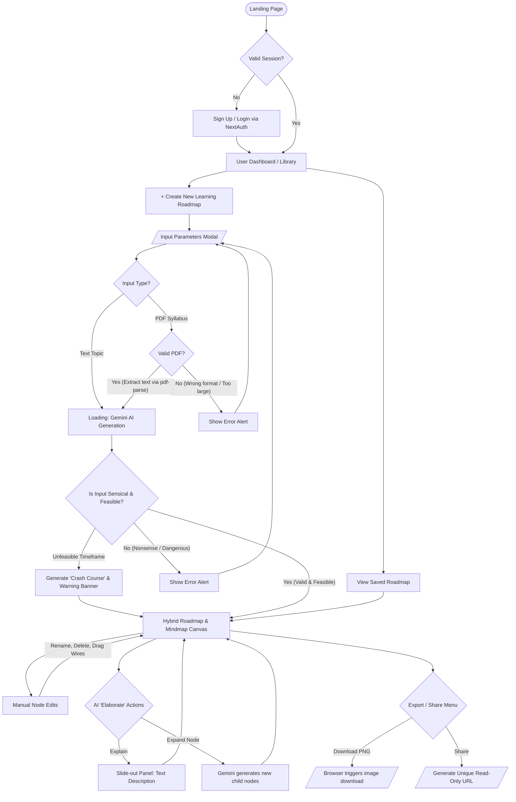

# SecondMind User Flow

```mermaid
graph TD
    A([Landing Page]) --> B{Valid Session?}
    B -- No --> C[Sign Up / Login via NextAuth]
    C --> D[User Dashboard / Library]
    B -- Yes --> D

    D --> E[View Saved Roadmap]
    D --> F[+ Create New Learning Roadmap]

    F --> G[/Input Parameters Modal/]
    
    G --> G1{Input Type?}
    G1 -- Text Topic --> H[Loading: Gemini AI Generation]
    G1 -- PDF Syllabus --> G2{Valid PDF?}
    
    G2 -- No (Wrong format / Too large) --> G3[Show Error Alert]
    G3 --> G
    
    G2 -- Yes (Extract text via pdf-parse) --> H
    
    H --> H1{Is Input Sensical & Feasible?}
    H1 -- "No (Nonsense / Dangerous)" --> H2[Show Error Alert]
    H2 --> G
    
    H1 -- "Unfeasible Timeframe" --> H3[Generate 'Crash Course' & Warning Banner]
    H3 --> I[Hybrid Roadmap & Mindmap Canvas]
    
    H1 -- "Yes (Valid & Feasible)" --> I
    
    E --> I

    I --> J[Manual Node Edits]
    J --> |Rename, Delete, Drag Wires| I

    I --> K{AI 'Elaborate' Actions}
    K -- "Explain" --> K1[Slide-out Panel: Text Description]
    K -- "Expand Node" --> K2[Gemini generates new child nodes]
    
    K1 --> I
    K2 --> I

    I --> L{Export / Share Menu}
    L -- "Download PNG" --> M[/Browser triggers image download/]
    L -- "Share" --> O[/Generate Unique Read-Only URL/]
```
