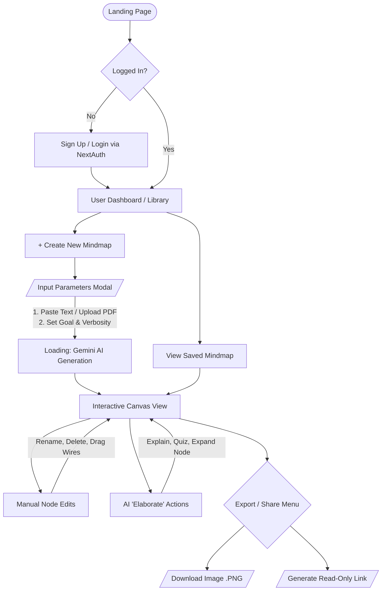

# SecondMind User Flow

Below is the complete user journey for SecondMind. Because this diagram is built using Mermaid (a text-based diagramming tool), it is entirely editable! You can change the text inside the blocks to adjust the flow as we refine the app.

